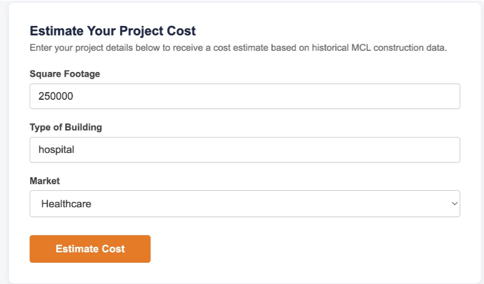
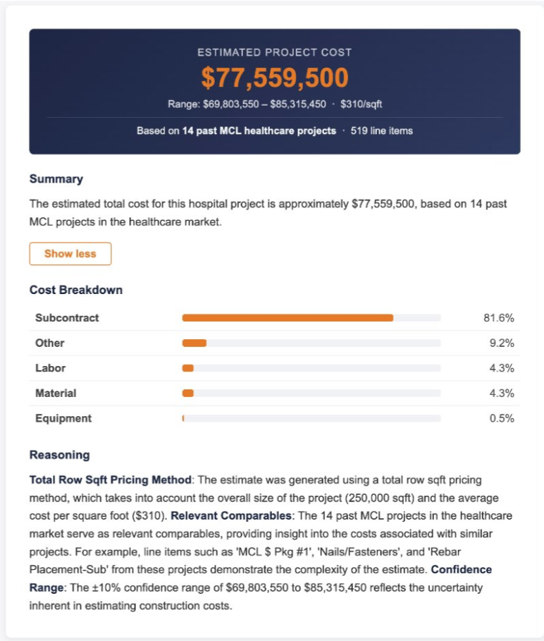

# MCL Construction Cost Estimator

> AI-powered construction cost estimation tool built for **MCL Construction** (Omaha, NE)  
> Developed as part of the IS&T Professional Development course at the University of Nebraska at Omaha

---

## Overview

MCL Construction needed a faster way to provide preliminary cost estimates to potential clients. Manually searching through historical project data could take hours or days — this tool reduces that to seconds.

The estimator takes three inputs from the user:
- **Square footage** of the project
- **Type of building** (e.g. office, hospital, school)
- **Market segment** (Healthcare, Education, Nonprofit, Office)

It returns a cost estimate with a confidence range, cost-per-sqft breakdown, cost category analysis, and a natural language explanation — all based on real historical MCL project data.

---

## The Problem

Customers approaching MCL want a starting price before committing to a full project. MCL needed a way to deliver quick, data-backed preliminary estimates without employees spending hours manually searching through spreadsheets.

---

## Architecture

```
Excel Files → SQLite → JSON → Query Layer → Llama3 (via Ollama) → Frontend
                                    ↑
                              Python handles
                              all calculations
```

**Key architectural decision:** Llama3 interprets natural language queries and generates explanations — but **never performs calculations**. All cost math is handled by Python scripts to eliminate hallucination risk on financial data.

---

## Tech Stack

**Backend**
- Python
- SQLite (data storage)
- Ollama + Llama3 (LLM inference)
- Node.js + Express (API layer)

**Frontend**
- HTML / CSS / JavaScript

**Data Pipeline**
- Excel → SQLite → JSON

---

## What It Does

- Selects relevant historical project data based on market and building type input
- Calculates total cost estimate from square footage using Python
- Returns confidence range (±10%) based on number of comparable past projects
- Provides cost breakdown by category — Subcontract, Labor, Material, Equipment, Other
- Generates natural language summary and detailed reasoning via Llama3
- Supports 4 market segments across 11 real MCL historical projects and 500+ line items

---

## Example Output

For a 1,000 sqft office project:
- **Estimated Cost:** $1,233,330
- **Range:** $1,109,997 – $1,356,663
- **Based on:** 2 past MCL office projects, 34 line items

For a 250,000 sqft hospital:
- **Estimated Cost:** $77,559,500
- **Range:** $69,803,550 – $85,315,450
- **Based on:** 14 past MCL healthcare projects, 519 line items

---

## Team

Built by a team of 4 UNO freshmen over one semester:
- Burrough Osborne
- Ethan Ndugwa
- Aasif Sultani
- Jessey Moore 

---

## Challenges

- All-freshman team navigating professional client work for the first time
- Exposure to new tools and methods under real project deadlines
- Adapting to losing a teammate mid-project while maintaining delivery

---

## Future Enhancements

- Add more project-specific inputs or open-ended query support
- Show all specific data pulled for transparency
- Store and track previous estimates for comparison
- Enhance explanations with clearer references to most relevant comparable data

---

## Note on Repository

This repository contains documentation only. The full codebase and project data are private — this tool was built for and delivered to MCL Construction as a production internal tool. Screenshots from the working application are included below.

---

## Demo

[▶ Watch Demo](https://youtu.be/NoQQIdBIoQA)

---

## Screenshots





